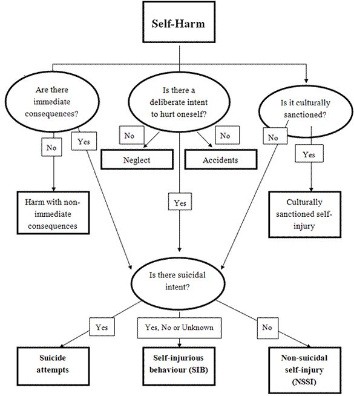
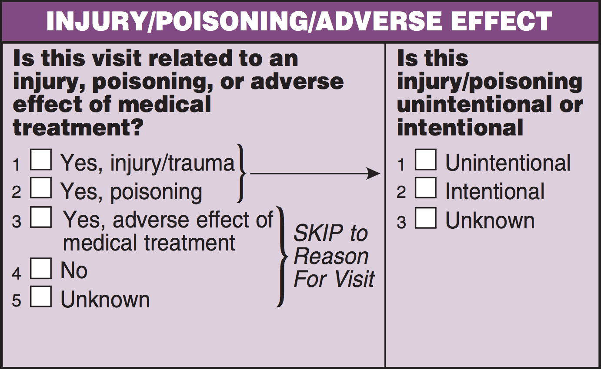
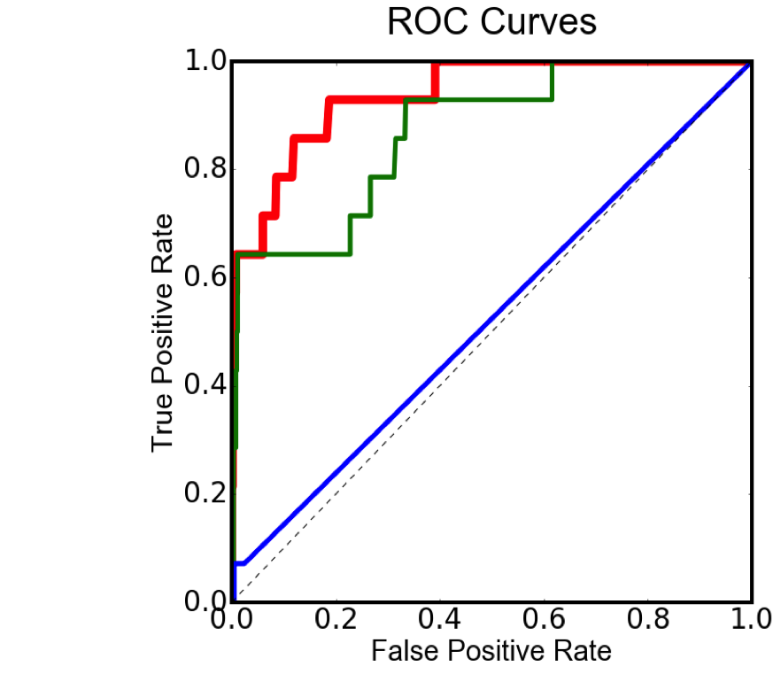

Yesterday at [Metis Data Science Bootcamp](http://www.thisismetis.com/data-science-bootcamps), each of us presented our third projects (dubbed 'McNulty'). Our task was to use machine learning techniques to train, test, and assess the prediction performance of a categorical classifier. I chose to use data from the 2012 [National Ambulatory Medical Care Survey](http://www.cdc.gov/nchs/ahcd/index.htm) to see how well I could predict whether an injury or poisoning treated by a physician had been intentionally self-inflicted or not. My hunch is that intentional self-injury will not always be identified as such, especially when the injury is mild enough to be treated in an outpatient setting. 

Why do some people intentionally, often repeatedly, injure themselves? [This article](240.full.pdf) provides a good background, describing the prevalence of intentional self-injury, its relationship to psychiatric disorders and suicidal behavior, what motivates it, and how it's assessed and treated, particularly in primary care. 

This flowchart* highlights some of the complexity involved in distinguishing different types of self-harm: 

Looking at the bottom of the chart, you can see that intentional self-injury may or may not be accompanied by suicidal intent. This can be difficult to assess, as many who self-injure are reluctant to discuss their motivations with a physician. However, it is known that intentional self-injury increases the risk of subsequent suicidal behavior. This makes identifying intentional self-injury in primary care all the more important.

The better we can identify patient characteristics associated with a physician assessing an injury as self-inflicted, the better we might be able to inform other physicians--including ones not inclined to suspect self-injury when an injury seems consistent with having had an accident. 

***

The NAMCS survey is carefully designed, and rate estimates derived from it are nationally representative of outpatient visits in the U.S. There were over 70,000 medical visits sampled in 2012 (the latest year for which full data were available), and more than 600 variables are [available for public use](http://www.cdc.gov/nchs/ahcd/ahcd_questionnaires.htm). I restricted my analysis to the ~2,500 injury-related visits. 

The only available patient [features](https://en.wikipedia.org/wiki/Feature_(machine_learning)) that were associated with injury intentionality were age and mental disorder status. Younger patients were significantly more likely to self-injure, as were patients for whom the physician listed at least one [ICD-9-CM mental disorder](https://en.wikipedia.org/wiki/List_of_ICD-9_codes_290%E2%80%93319:_mental_disorders). On the strength of those two features, I was able to develop a classifier that correctly identified 79% of the cases of self-injury in a held-out testing dataset. This is called the [recall](https://en.wikipedia.org/wiki/Precision_and_recall#Recall) rate, which is the percentage of positive cases that were identified as positive. The "price" for achieving that rather high recall rate was very low [precision](https://en.wikipedia.org/wiki/Precision_and_recall#Precision), which means that the classifier also wrongly identified many non-intentional cases as intentional. With a larger dataset and additional features, I hope to be able to improve on precision. 

Since completing my analysis, I've found one machine learning project concerned with non-suicidal self-injurious behavior, at [MIT MEDIA LAB](https://www.media.mit.edu/research/groups/1447/valinor-mathematical-models-understand-and-predict-self-harm
). 

***

*downloaded from  [www.csc-scc.gc.ca](http://www.csc-scc.gc.ca/research/005008-0216-01-eng.shtml) 

